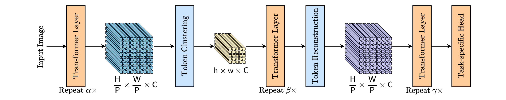

# Expediting Large-Scale Vision Transformer for Dense Prediction without Fine-tuning

## Introduction

This is the official implementation of the paper "[Expediting Large-Scale Vision Transformer for Dense Prediction without Fine-tuning](https://arxiv.org/abs/2210.01035)" on [SWAG](https://arxiv.org/abs/2201.08371). 




We will also implement several token-reduction methods on SWAG.

+ [EViT](https://github.com/youweiliang/evit)
+ [ATS](https://github.com/adaptivetokensampling/ATS)
+ [Evo-ViT](https://github.com/YifanXu74/Evo-ViT)
+ [ACT](https://github.com/gaopengcuhk/SMCA-DETR/tree/main/Adaptive_Cluster_Transformer)
+ [SMYRF](https://github.com/giannisdaras/smyrf)
+ [ToMe](https://github.com/facebookresearch/ToMe)

## Results 

### Ours

| Method      | Backbone | $\alpha$ | h $\times$ w   | GFLOPs | FPS  | Throughput (im/s) | Acc.     |
| ----------- | -------- | -------- | -------------- | ------ | ---- | ----------------- | -------- |
| SWAG        | ViT-L/16 | -        | 32 $\times$ 32 | 364.8  | 12.7 | 14.7              | **88.1** |
| SWAG + Ours | ViT-L/16 | 12       | 23 $\times$ 23 | 275.8  | 15.8 | 19.5              | 87.8     |
| SWAG + Ours | ViT-L/16 | 6        | 23 $\times$ 23 | 228.5  | 19.4 | 24.3              | 87.7     |
| SWAG + Ours | ViT-L/16 | 8        | 16 $\times$ 16 | 179.0  | 23.3 | 29.7              | 87.2     |
| SWAG        | ViT-H/14 | -        | 37 $\times$ 37 | 1023.2 | 5.0  | 5.3               | **88.5** |
| SWAG + Ours | ViT-H/14 | 10       | 26 $\times$ 26 | 652.4  | 7.4  | 8.4               | 88.4     |
| SWAG + Ours | ViT-H/14 | 4        | 25 $\times$ 25 | 514.1  | 9.8  | 11.0              | 87.6     |
| SWAG + Ours | ViT-H/14 | 8        | 18 $\times$ 18 | 422.7  | 11.2 | 13.1              | 87.4     |

### EViT

| Method      | Backbone | keep rate | GFLOPs | FPS  | Throughput (im/s) | Acc.     |
| ----------- | -------- | --------- | ------ | ---- | ----------------- | -------- |
| SWAG        | ViT-L/16 | -         | 364.8  | 12.7 | 14.7              | **88.1** |
| SWAG + EViT | ViT-L/16 | 0.8       | 264.9  | 17.4 | 20.1              | 87.9     |
| SWAG + EViT | ViT-L/16 | 0.7       | 227.1  | 19.7 | 23.5              | 87.8     |
| SWAG + EViT | ViT-L/16 | 0.5       | 170.2  | 24.9 | 31.0              | 87.1     |
| SWAG        | ViT-H/14 | -         | 1023.2 | 5.0  | 5.3               | **88.5** |
| SWAG + EViT | ViT-H/14 | 0.7       | 632.3  | 8.0  | 8.6               | 88.4     |
| SWAG + EViT | ViT-H/14 | 0.6       | 544.4  | 9.2  | 10.0              | 88.3     |
| SWAG + EViT | ViT-H/14 | 0.5       | 472.0  | 10.3 | 11.5              | 88.0     |

### ToMe

| Method      | Backbone | r    | GFLOPs | FPS  | Throughput (im/s) | Acc.     |
| ----------- | -------- | ---- | ------ | ---- | ----------------- | -------- |
| SWAG        | ViT-L/16 | -    | 364.8  | 12.7 | 14.7              | **88.1** |
| SWAG + ToMe | ViT-L/16 | 10   | 317.5  | 13.8 | 15.7              | 88.0     |
| SWAG + ToMe | ViT-L/16 | 20   | 271.2  | 16.2 | 18.9              | 87.9     |
| SWAG + ToMe | ViT-L/16 | 40   | 184.3  | 22.7 | 28.1              | 87.7     |
| SWAG        | ViT-H/14 | -    | 1023.2 | 5.0  | 5.3               | **88.5** |
| SWAG + ToMe | ViT-H/14 | 10   | 890.0  | 5.3  | 5.9               | 88.5     |
| SWAG + ToMe | ViT-H/14 | 20   | 760.0  | 6.3  | 7.1               | 88.4     |
| SWAG + ToMe | ViT-H/14 | 40   | 516.9  | 9.2  | 10.7              | 88.2     |

### ACT

| Method     | Backbone | q_hashes | GFLOPs | FPS  | Throughput (im/s) | Acc.     |
| ---------- | -------- | -------- | ------ | ---- | ----------------- | -------- |
| SWAG       | ViT-L/16 | -        | 364.8  | 12.7 | 14.7              | **88.1** |
| SWAG + ACT | ViT-L/16 | 16       | 333.5  | 9.5  | 13.0              | 85.1     |
| SWAG + ACT | ViT-L/16 | 20       | 341.8  | 9.2  | 12.4              | 87.3     |
| SWAG + ACT | ViT-L/16 | 24       | 346.2  | 9.0  | 11.9              | 87.8     |
| SWAG + ACT | ViT-L/16 | 32       | 352.5  | 8.8  | 11.3              | 88.0     |
| SWAG       | ViT-H/14 | -        | 1023.2 | 5.0  | 5.3               | **88.5** |
| SWAG + ACT | ViT-H/14 | 16       | 923.3  | 4.4  | 5.0               | 83.8     |
| SWAG + ACT | ViT-H/14 | 20       | 943.5  | 4.3  | 4.8               | 87.5     |
| SWAG + ACT | ViT-H/14 | 24       | 956.0  | 4.2  | 4.6               | 88.2     |
| SWAG + ACT | ViT-H/14 | 32       | 978.5  | 4.1  | 4.4               | 88.5     |

### ATS

| Method     | Backbone | $\alpha$ | GFLOPs | FPS  | Throughput (im/s) | Acc.     |
| ---------- | -------- | -------- | ------ | ---- | ----------------- | -------- |
| SWAG       | ViT-L/16 | -        | 364.8  | 12.7 | 14.7              | **88.1** |
| SWAG + ATS | ViT-L/16 | 20       | 323.3  | 14.0 | 16.2              | 84.0     |
| SWAG + ATS | ViT-L/16 | 18       | 306.2  | 14.8 | 17.1              | 80.4     |
| SWAG + ATS | ViT-L/16 | 16       | 292.1  | 15.5 | 17.9              | 76.0     |
| SWAG       | ViT-H/14 | -        | 1023.2 | 5.0  | 5.3               | **88.5** |
| SWAG + ATS | ViT-H/14 | 18       | 731.4  | 6.8  | 7.2               | 88.0     |
| SWAG + ATS | ViT-H/14 | 16       | 693.4  | 7.3  | 7.7               | 87.5     |
| SWAG + ATS | ViT-H/14 | 14       | 676.3  | 7.1  | 7.3               | 87.1     |

### Evo-ViT

| Method         | Backbone | pruning location | pruning ratio | GFLOPs | FPS  | Throughput (im/s) | Acc.     |
| -------------- | -------- | ---------------- | ------------- | ------ | ---- | ----------------- | -------- |
| SWAG           | ViT-L/16 | -                | -             | 364.8  | 12.7 | 14.7              | **88.1** |
| SWAG + Evo-ViT | ViT-L/16 | 18               | 0.4           | 307.0  | 14.8 | 17.2              | 87.6     |
| SWAG + Evo-ViT | ViT-L/16 | 8                | 0.6           | 259.1  | 17.7 | 19.7              | 86.3     |
| SWAG + Evo-ViT | ViT-L/16 | 8                | 0.4           | 210.6  | 20.8 | 25.0              | 84.0     |
| SWAG           | ViT-H/14 | -                | -             | 1023.2 | 5.0  | 5.3               | **88.5** |
| SWAG + Evo-ViT | ViT-H/14 | 16               | 0.6           | 799.8  | 6.0  | 6.6               | 88.1     |
| SWAG + Evo-ViT | ViT-H/14 | 14               | 0.5           | 713.5  | 6.8  | 7.5               | 87.4     |
| SWAG + Evo-ViT | ViT-H/14 | 14               | 0.3           | 602.0  | 8.1  | 8.9               | 85.6     |

### SMYRF

| Method     | Backbone | $\alpha$ | rounds | q_cluster_size | k_cluster_size | GFLOPs | FPS  | Throughput (im/s) | Acc. |
| ---------- | -------- | -------- | ------ | ---- | ---- | ---- | ---- | ----------------- | -------- |
| SWAG        | ViT-L/16 | -  | -  | -  | -  | 364.8  | 12.7 | 14.7 | **88.1** |
| SWAG + SMYRF | ViT-L/16 | 12 | 32 | 64 |  64  | 392 | 6.01  | 6.66 | 86.5 |
| SWAG + SMYRF | ViT-L/16 | 12 | 32 | 32 |  32  | 365.6 | 6.54  | 7.32 | 86.3 |
| SWAG + SMYRF | ViT-L/16 | 12 | 32 | 16 |  16  | 352.4 | 6.64  | 7.48 | 86.0 |
| SWAG        | ViT-H/14 | -  | -  | -  | -  | 1023.2 | 5.0  | 5.3 | **88.5** |
| SWAG + SMYRF | ViT-H/14 | 16 | 32 | 64 |  64  | 1063.8 | 2.77  | 2.87 | 87.3 |
| SWAG + SMYRF | ViT-H/14 | 16 | 32 | 32 |  32  | 1005.3 | 2.84  | 3.01 | 87.4 |
| SWAG + SMYRF | ViT-H/14 | 16 | 32 | 16 |  16  | 975.98 | 2.89  | 3.04 | 87.2 |


## Requirements

This code has been tested to work with Python 3.8, PyTorch 1.10.1 and torchvision 0.11.2. 

Note that CUDA support is not required for the tutorials.

To setup PyTorch and torchvision, please follow PyTorch's getting started [instructions](https://pytorch.org/get-started/locally/). If you are using conda on a linux machine, you can follow the following setup instructions  - 

```console
conda create --name swag python=3.8
conda activate swag
conda install pytorch torchvision torchaudio cudatoolkit=10.2 -c pytorch
```

To use ToMe, you can install the ToMe library as follows:

```console
pip install torch-scatter
cd models/ops/tome
python setup.py build develop
```

To use Act-ViT, you can install the ACT library as follows:

```console
cd models/ops
python setup.py install
```

## ImageNet 1K Evaluation

We also provide a script to evaluate the accuracy of our models on ImageNet 1K, [imagenet_1k_eval.py](imagenet_1k_eval.py). This script is a slightly modified version of the PyTorch ImageNet [example](https://github.com/pytorch/examples/blob/master/imagenet/main.py) which supports our models.

To evaluate our methods, use the command as below.

```console
python imagenet_1k_eval.py -m hourglass_vit_l16_in1k -r 512 -b 256 -l 12 -n 529 /path/to/dataset
```

To commpute the latency and cost of our methods, use the command as below.

```console
python get_flops_fps.py -m hourglass_vit_l16_in1k -r 512 -b 256 -l 12 -n 529
```

## Citation

If you find Hourglass-SWAG is useful in your research, please give us a star and cite:  

```bibtex
@misc{singh2022revisiting,
      title={Revisiting Weakly Supervised Pre-Training of Visual Perception Models}, 
      author={Singh, Mannat and Gustafson, Laura and Adcock, Aaron and Reis, Vinicius de Freitas and Gedik, Bugra and Kosaraju, Raj Prateek and Mahajan, Dhruv and Girshick, Ross and Doll{\'a}r, Piotr and van der Maaten, Laurens},
      journal={arXiv preprint arXiv:2201.08371},
      year={2022}
}

@article{liang2022expediting,
  title={Expediting large-scale vision transformer for dense prediction without fine-tuning},
  author={Liang, Weicong and Yuan, Yuhui and Ding, Henghui and Luo, Xiao and Lin, Weihong and Jia, Ding and Zhang, Zheng and Zhang, Chao and Hu, Han},
  journal={arXiv preprint arXiv:2210.01035},
  year={2022}
}
```

## License

Hourglass-SWAG are released under the CC-BY-NC 4.0 license. See [LICENSE](LICENSE) for additional details.
